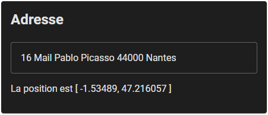
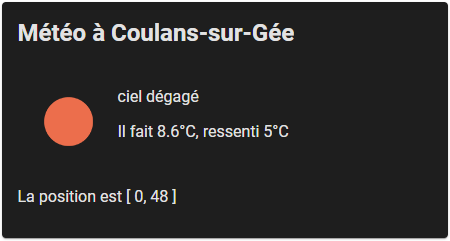
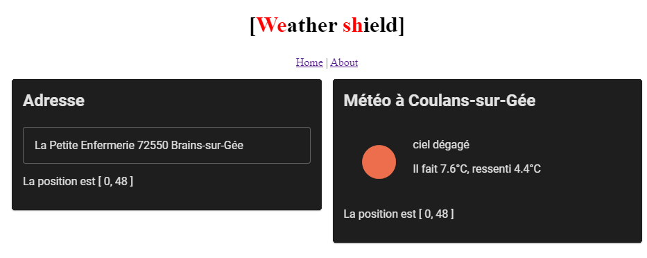
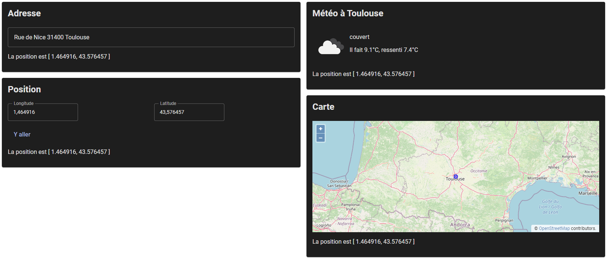

# VueJS : approche par composants, reactivité et store
L'objectif est d'illustrer l’approche par composant, la réactivité et l'utilisation du store VueX. Ce qu'on va chercher à faire ici c'est :
* faire une recherche d'adresse via https://adresse.data.gouv.fr/api-doc/adresse pour récuperer une localisation géographique (en France)
* récupérer des prévisions météos https://openweathermap.org/api sur cette localisation

# Prérequis et postulats
L'état initial est un projet VueJS 3 (typescript, vuex) initialisé via vue-cli (couvert par un précédent article). Le ficher `src/views/Home.vue` généré est nettoyé :
```ts
// src/views/Home.vue
<template>
  <div class="home">
  </div>
</template>

<script lang="ts">
import { Options, Vue } from "vue-class-component";

@Options({
  components: {
  },
})
export default class Home extends Vue {}
</script>

<style scoped>
.home {
  padding: 10px;
}
</style>
```

Installation de dépendances complémentaires :
```cmd
npm install primevue --save
npm install primeicons --save
npm install primeflex --save
```

Nous ne rentrerons pas dans le détails des composants graphiques PrimeVue, la documentation est accessible ici https://www.primefaces.org/primevue/.

# Composants de base
## Recherche d'adresses
Pour la recherche d'adresse, on va s'appuyer sur le composant [Autocompete](https://www.primefaces.org/primevue/showcase/#/autocomplete) de PrimeVue. Ce composant modifie une propiété *typedAddress* via le pattern [v-model](https://v3.vuejs.org/guide/migration/v-model.html#overview) de vuejs, il utilise une méthode *search* pour remplir une liste de *suggestions* de résultats. L'utilisateur choisit sur le bon résultat, le composant émet alors l'événement *item-select*. 

Nous supposerons ici avoir l'implémentation d'un service *AddressSearchService* permettant d'effectuer la recherche conformément à la documentation de l'api *search* décrite [ici](https://adresse.data.gouv.fr/api-doc/adresse]). Basiquement, cette API renvoie une liste de *features* avec les coordonnées (lon, lat) dans *geometry.coordinates* et les informations d'adresse dans un objet *properties*, l'adresse étant accessible dans le champ *properties.label*.

```ts
// Fichier `src/components/AddressSearch.vue`:
<script lang="ts">
import { defineComponent } from 'vue';

import { AddressSearchService } from '@/services/address-api';

export default defineComponent({
    data() {
        return {
            typedAddress: null as string|null,
            suggestions: [] as unknown[],
            position: [number, number]
        }
    },
    methods: {
        search(event: {originalEvent: Event, query: string}): void {
            AddressSearchService.getInstance().search(event.query).then(
                (data: any) => {
                    this.suggestions = [...data.features];
                }
            );
        },
        select(event: {originalEvent: Event, value: any}): void {
            // event.value holds the selected feature
            this.typedAddress = event.value.properties.label;
            this.position = event.value.geometry.coordinates;
        }
    }
})
</script>
```
Dans les attributs "data" du composant, on retrouve :
* *typeAddress* qui sera mappé vers le champ de saisi donné en *v-model* du composant *Autocomplete*
* *suggestions* qui est un tableau rempli avec toutes les *features* renvoyées par la méthode search de la recherche d'adresses
* *position* qui est renseignée à la sélection via la méthode *select*, on surcharge également *typedAddress* pour correspondre au label sélectionné.

On entrevoit dans cette exemple la structure d'un "single file component" de vue décrite dans la documentation : https://v3.vuejs.org/guide/single-file-component.html#single-file-components. Une spécificité à laquelle on se fait vite, *data* est une **méthode qui renvoie un objet** contenant les attributs et pas directement un objet ou un attribut.

Ajoutons le code "html":
```ts
// Fichier `src/components/AddressSearch.vue`:
<template>
    <Card>
        <template #title>Adresse</template>
        <template #content>
            <div class="p-fluid">
                <AutoComplete id="search_address" 
                    v-model="typedAddress" 
                    :suggestions="suggestions" 
                    @complete="search($event)" 
                    @item-select="select($event)" 
                    field="properties.label" />
            </div>
            <p></p>
            <div v-if="position !== null">
                La position est {{ position }}
            </div>
        </template>
    </Card>
</template>

<script lang="ts">
...
import Card from 'primevue/card';
import AutoComplete from 'primevue/autocomplete';
...
export default defineComponent({
    components: {
        Card,
        AutoComplete
    },
    data() {
        ...
    },
    methods:{
        ...
    }
})
</script>
```
La balise *template* comporte du code au format html avec les augmentations du langage VueJS:
* les composants sont accessibles via des tags personnalisés. C'est le cas ici de *Card* ou *Autocomplete* : ils sont importé dans le javascript, déclarés dans l'attributs *components* du composant et utilisés dans le *template* (ex.: `<Card>...</Card>`)
* les attributs html sont directement mappés si ils commencents par ":". Par exemple, ci-dessus `:suggestions="suggestions"` va bien chercher les valeurs du composant (en "javascript"), par contre, `field="properties.label"`, ne commence pas par ":", "properties.label" est donc traité comme du texte.
* Sur une balise, les événements sont exploitables via la syntaxe `@event="methode()"`
* en dehors d'une balise html, la syntaxe `{{ }}` permet d'accéder au valeur des propriétés, exemple `La position est {{ position }}`
* il existe des opérateurs pour conditionner la génération de certains bloc, ex. `<div v-if="position !== null">` n'affiche ce bloc que si position n'est pas `null`.

Le résultat donnera le composant ci-dessous :


## Récupération de la météo
On fait la même chose pour la récupération des informations météo en une position. Pour cela, on a un implémentation d'un service sur openWeatherApi (il faut une clé d'API, c'est gratuit mais il faut créer un compte). On va utiliser 2 api :
* *oncall* qui renvoie pas mal d'informations sur la météo courante et les prédictions
* *reverse* qui fait un géocodage inverse, histoire de savoir où l'api météo nous envoie, si tout va bien, ce ne sera pas trop loin de l'adresse cherchée !

Ces appels d'api sont fait via les méthodes *getWeather* et *getLocation* du composant *WeatherCard*.

> Pour la lecture, rappelez vous la structure d'un single file component (*tempate* -> le html, *:attribut* ou *{{ attribut }}* -> propriété bindée vers le javascript, *@event="methode()"* -> hook sur un événement, *data()*: -> les attributs internes, *computed* -> les attributs calculés qui agissent comme des attributs même si ce sont des méthodes, *methods:* -> les méthodes du composant)

Ficher `src/components/WeatherCard` : 
```ts
<template>
    <Card>
        <template #title>
            Météo <span v-if="location !== null">à {{ locationName }}</span>
        </template>
        <template #content>
            <div v-if="currentWeather !== null" class="flex">
                
                <div>
                    <p>{{ currentWeatherDescription }}</p>
                    <p>Il fait {{ formatTemp(currentWeather.temp) }}, ressenti {{ formatTemp(currentWeather.feels_like) }}</p>
                </div>
            </div>
            <p></p>
            <div v-if="position !== null">La position est {{ position }}</div>
        </template>
    </Card>
</template>

<script lang="ts">
import { defineComponent, PropType } from 'vue';

import Card from 'primevue/card';

import { WeatherService, currentWeatherI, locationI } from '@/services/weather-api';

export default defineComponent({
    components: {
        Card
    },
    data() {
        return {
            location: null as locationI|null,
            currentWeather: null as currentWeatherI|null,
            position: [0., 48.]
        }
    },
    computed: {
        locationName(): string {
            // return fench name if exists or internal feature_name
            if( this.location !== null ) {
                if( 'fr' in this.location.local_names ) {
                    return this.location.local_names['fr'];
                } else if( 'feature_name' in this.location.local_names ) {
                    return this.location.local_names['feature_name'];
                } else {
                    return '';
                }
            } else {
                return '';
            }
        },
        currentWeatherDescription(): string {
            // return weather description if any 
            if( this.currentWeather !== null && ) {
                return this.currentWeather.weather[0].description;
            } else {
                return '';
            }
        },
        currentWeatherIcon(): string {
            // return weather icon url
            if( this.currentWeather !== null ) {
                return "http://openweathermap.org/img/wn/" + this.currentWeather.weather[0].icon + '@2x.png';
            } else {
                return '';
            }
        }
    },
    created() {
        this.getLocation();
        this.getWeather();
    },
    methods:{
        getLocation(): void {
            if( this.position !== null ) {
                this.location = null;
                WeatherService.getInstance().reverse(this.position).then(
                    (data: any) => {
                        this.location = data[0] as locationI;
                    }
                );
            }
        },
        getWeather(): void {
            if( this.position !== null ) {
                this.currentWeather = null;
                WeatherService.getInstance().onecall(this.position).then(
                    (data: any) => {
                        this.currentWeather = data.current as currentWeatherI;
                    }
                );
            }
        },
        formatTemp(temp: number): string {
            return '' + Math.round(temp * 10) / 10 + '°C';
        }
    }
})
</script>
```
Trois choses notables sur cet exemple:
* La position est définie en dur, `position: [0., 48.]`. C'est voulu pour le moment, l'objectif est de voir ensuite comment gérer de manière synchrone cette position via le store VueX.
* la méthode `created()` qui correspond au [cycle de vie](https://v3.vuejs.org/guide/composition-api-lifecycle-hooks.html#lifecycle-hooks) d'un composant vue et en l'occurence qui est appelé à la création du composant. 
* l'utilisation des propriétés *computed* qui permet de simplifier la gestion de l'affichage, ne pas hésiter non plus à utiliser des méthodes de formattage comme `formatTemp` qui permettent souvent de simplier le *template*.

Le résultat donnera le composant ci-dessous :


## Bilan d'étape
On a donc implémenté 2 composants, un permettant de définir une location géographique à partir d'une adresse, l'autre récupérant les informations météo sur une localisation géographique, pour le moment en dur. On va commencer par afficher ces composants sur le site :
```ts
<template>
  <div class="home">
    <div class="grid ">
      <div class="field col">
        <AdressSearch />
      </div>
      <div class="field col">
        <WeatherCard />
      </div>
    </div>
  </div>
</template>

<script lang="ts">
import { Options, Vue } from "vue-class-component";
import AdressSearch from "@/components/AddressSearch.vue";
import WeatherCard from "@/components/WeatherCard.vue";

@Options({
  components: {
    AdressSearch,
    WeatherCard
  },
})
export default class Home extends Vue {}
</script>

<style scoped>
.home {
  padding: 10px;
}
</style>
```
Cela doit rendre quelque chose comme ça :


> L'étape suivante est de relier les 2 composants en utilisant le store VueX. Ce n'est pas la méthode la plus simple, surtout dans notre cas de figure où, pour le moment, il n'y a que 2 composants. Néanmoins, cette approche est nécessaire la plupart du temps dans un projet et on peut se perdre dans des implémentations complexes avant de s'en rendre compte.

On rajoutera d'autres composants en fin d'exercice pour illustrer l'intérêt de la méthode.

# Synchronisation des composants
[VueX](https://next.vuex.vuejs.org) est une librairie de gestion d'états pour VueJS. Il fournit un entrepot (store) d'états (state) centralisé pour les composants de l'application.

Le store comporte les principales entités suivantes :
* *State* : contient les valeurs ou les objets à centraliser
* *Mutations* : méthodes synchrones de modification des états
* *Actions* : méthodes asynchrones déclenchant les mutations

La différence entre *Mutations* et *Actions* n'est pas nécessairement évidente au début, surtout que toutes les méthodes (*Actions* ou *Mutations*) sont accessibles des composants. Le mieux est de s'en tenir à la règle suivante : 
> les composants étendent le store pour accéder aux attributs, pour modifier un attribut, les composants dispatchent les actions qui vont commiter des mutations, en fin de chaine, les composants réagissent à la modification des attributs du store (propriétés *reactives*)

Ci-dessous le pattern du store [VueX](https://next.vuex.vuejs.org/) extrait de sa documentation:


## Mise en place du store
L'utilisation du typescript complexifie un peu la mise en oeuvre du store. En effet, il est nécessaire de typer les entités du store qui sont plutôt conçues dynamiques pour être étendues au gré des développements.

On commence par définir le contenu de notre store, ici une coordonnée géographique que l'on initialise à *null*.
```ts
// src/store/index.tx
import { createStore } from "vuex";

export interface State {
  position: [number, number]|null
}

export default createStore({
  state: {
    position: null
  } as State,
  mutations: {
  },
  actions: {
  },
  modules: {},
});
```
On ajoute la mutation qui met à jour la valeur de la coordonnée.
```ts
// src/store/index.tx
...
  mutations: {
    setPosition(state, position: [number, number]): void {
      state.position = position;
    }
  },
...
```
On ajoute l'action qui commite la mutation.
```ts
// src/store/index.tx
...
  actions: {
    setPosition(context, position: [number, number]): void {
      context.commit('setPosition', position);
    }
  },
...
```
En javascript, le *this* d'un composant possède un attribut *$store* pour accéder au store, en typescript, il est nécessaire de le déclarer spécifiquement.

Fichier `src/shims-vuex.d.ts`
```ts
import { ComponentCustomProperties } from 'vue'
import { Store } from 'vuex'
import { State } from 'store'

declare module '@vue/runtime-core' {
  // provide typings for `this.$store`
  interface ComponentCustomProperties {
    $store: Store<State>
  }
}
```
> Je préconise de redémarrer son visual studio code et de relancer le `npm run serve` après l'ajout du fichier `shims-vuex.d.ts` afin d'assurer sa prise en compte.

Maintenant, le store est en place est prêt à être utilisé par les composants.

## Mise à jour des composants de base
Le principe est de supprimer l'attribut *position* interne de nos composants pour utiliser le store. Pour cela, on va utiliser la fonction utilitaire *mapState* de vuex, supprimer *position* dans *data* et ajouter un attribut *computed*. 

Côté `src/components/AddressSearch.vue`, il faut également utiliser l'action *setPosition* du store pour modifier la valeur. Les modifications sont identifiées via le commentaire "--> Utilisation du store".
```ts
// Fichier `src/components/AddressSearch.vue`:
<script lang="ts">
import { defineComponent } from 'vue';

import { AddressSearchService } from '@/services/address-api';

// --> Utilisation du store
import { mapState } from 'vuex';
import { State } from '@/store';
// <-- Utilisation du store

export default defineComponent({
    data() {
        return {
            typedAddress: null as string|null,
            suggestions: [] as unknown[],
            // --> Utilisation du store
            // position: [number, number]
            // <-- Utilisation du store
        }
    },
    // --> Utilisation du store
    computed: {
        ...mapState({
            position: state => (state as State).position
        })
    },
    // <-- Utilisation du store
    methods:{
        search(event: {originalEvent: Event, query: string}): void {
            AddressSearchService.getInstance().search(event.query).then(
                (data: any) => {
                    this.suggestions = [...data.features];
                }
            );
        },
        select(event: {originalEvent: Event, value: any}): void {
            // event.value holds the selected feature
            this.typedAddress = event.value.properties.label;

            // --> Utilisation du store
            // this.position = event.value.geometry.coordinates;
            this.$store.dispatch('setPosition', event.value.geometry.coordinates)
            // <-- Utilisation du store
        }
    }
})
</script>
```
Il faut également transformer l'attribut *position* sur `src/components/WeatherCard.vue` comme précédemment. 

A ce moment, on se rend compte que la valeur de position est synchronisée entre les 2 composants mais que les prévisions météos ne s'actualisent pas. En effet, il faut provoquer ce rafraichissement des prévisions en cas de modification de *position*. L'attribut *position* étant réactif, il suffit de rajouter une instruction *watch* sur l'attribut.

```ts
// src/components/WeatherCard.vue
...
    created() {
        this.getLocation();
        this.getWeather();
    },
    // --> Utilisation du store
    watch: {
        position() {
            this.getLocation();
            this.getWeather();
        }
    },
    // <-- Utilisation du store
...
```
Cela rend quelque chose comme ça :

 
# Conclusion
Cet exemple permet de se familiariser avec la syntaxe des comopsants VueJS, en typescript, dans ce qui s'appelle l'[Option API](https://v3.vuejs.org/guide/typescript-support.html#using-with-options-api). Une nouveauté de VueJS est la [Composition API](https://v3.vuejs.org/guide/composition-api-introduction.html#why-composition-api) qui permet une meilleure mutualisation du code entre les composants, mais je trouve au détriment de la lisibilité du code, surtout dans un [Single File Component](https://v3.vuejs.org/guide/single-file-component.html#introduction).


Elle donne aussi les clés pour mettre en place un store partagé et reactif. L'exemple peut être étendu avec d'autres composants qui se synchronise tous en cas de modification de position, cf. ci-dessous.

L'utilisation du store est optionnelle dans un projet VueJS et sa mise en oeuvre n'est pas si triviale (surtout en typescript), néanmoins, pour un projet réel, son utilité est plus que probable et on peut vite se perdre à essayer de gérer "à la main" le partage d'une information via les propriétés et les événments de chaque composant.

A noter que la *composition API* fournit un mécanisme d'injection de propriétés qui est plutôt un pattern d'inversion de contrôle mais qui facilite le partage d'information entre les composants.
